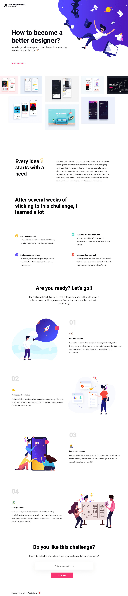

# Aufgabenstellung

_Wie werde ich ein besserer Designer?_

__Anfang des Jahres (Januar 2018)__

Ich begann darüber nachzudenken, wie ich meine Design Fähigkeiten verbessern und mehr Kunden anziehen könnte. Ich wollte ein paar Ideen entwerfen, die ich lange Zeit nur auf Papier hatte. Ich entschied mich, nach einer Herausforderung zu suchen, die mit meinen Gedanken kompatibel ist. Ich habe gesehen, dass viele Designer (vor allem in Dribbble) eine tägliche Benutzeroberfläche erstellt haben. Die Idee hat mir sehr gut gefallen, aber das Problem war, dass das Ergebnis nur etwas Schönes war und kein Problem löste.

So kam ich mit dieser täglichen Herausforderung.

Mit dieser Website möchte ich meine Arbeit mit Euch teilen.

## Inhalt

TheDesignProject by a WebDesigner

__How to become a better designer?__

A challenge to improve your product design skills by solving problems in your daily life.

SCROLL TO SEE MORE —

__Every idea starts with a need__

Earlier this year (January 2018). I started to think about how I could improve my design skills and attract more customers. I wanted to start designing some ideas that for a long time I had only on paper and stored on my cell phone, I decided to look for some challenge, something that makes more sense with what I thought. I saw that many designers (especially in dribbble) made a daily user interface, I really liked the idea, but the problem was that the result was just something nice and did not solve any problem.

After several weeks of sticking to this challenge, I learned a lot

__Start with asking why__

You will start seeing things differently and coming up with more effective ways of achieving goals.

__Your ideas will have more value__

By looking at problems from a different perspective, your ideas will be fresher and more valuable.

__Design solutions with love__

Only when you experience a problem yourself do you understand the frustration of the users and resolve to end it.

__Share and show your work__

As designers, we are often afraid of showing work that’s not finished or doesn’t look perfect. You will learn to accept feedback and learn from it.

__Are you ready? Let’s go!!__

The challenge lasts 30 days. On each of those days you will have to create a solution to any problem you yourself are facing and show the result to the community.

__Find your problem__

It has to be a problem that’s personally affecting or affected you, like finding your keys, calling a taxi or even remembering something. Open your eyes, look around you carefully and pay close attention to your surroundings.

__Think about the solution__

It's time to look for solutions. What can you do to solve these problems? It's time to think out of the box, grab your notebook and start writing down all the ideas that come to mind.

__Design your proposal__

How can design help solve your problem? It's time to think about features and functionality, and then start designing. Don’t forget to always ask yourself: Would I actually use this?

__Share your work__

Share your design on instagram or dribbble with the hashtag #thedesignproject Remember to explain what the problem was, how you came up with the solution and how the design achieves it. Find out what people have to say about it.

__Do you like this challenge?__

Subscribe to be the first to hear about updates, tips and recommendations!

## Assets

__Font:__ Roboto

__Farbe:__ #0B0C17 / #FF3571 / #DDD/ #3C30FF / #FFF / #000

## Ergebnisvorschau

